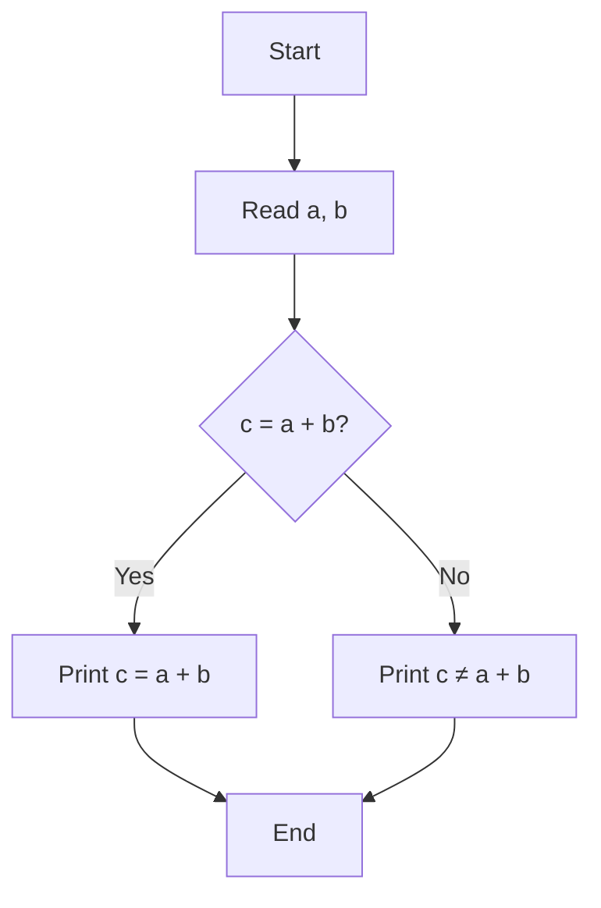
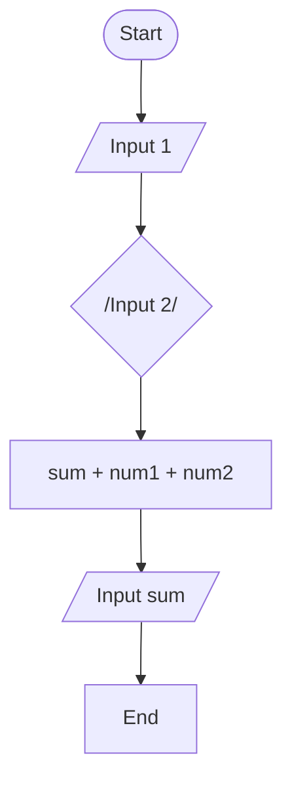
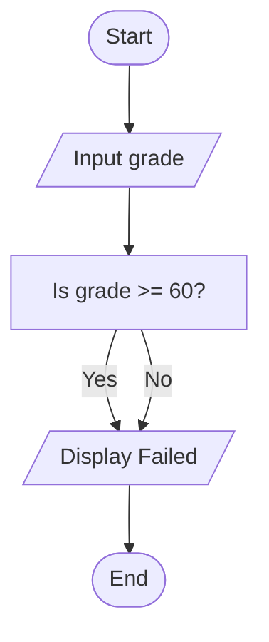

```mermaid
flowchart TD
A[Start] --> B[Read a, b]
B --> C{c = a + b?}
C -- Yes --> D[Print c = a + b]
C -- No --> E[Print c ≠ a + b]
D --> F[End]
E --> F[End]
```

```mermaid
flowchart TD
A([Start]) --> B[/Input 1/]
B --> C{/Input 2/}
C --> D[sum + num1 + num2]
D --> E[/Input sum/]
E --> F[End]
```

```mermaid
flowchart TD
A([Start]) --> B[/Input grade/]
B --> C[Is grade >= 60?]
C -- Yes --> D[/Display Passed/]
C -- No --> D[/Display Failed/]
D --> F([End])
```